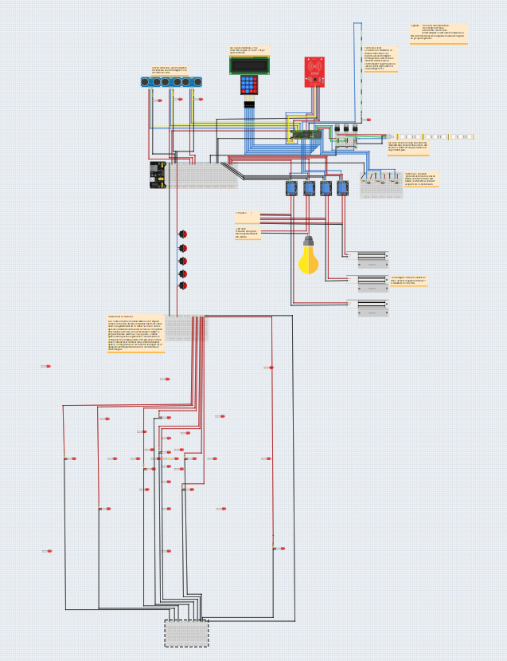
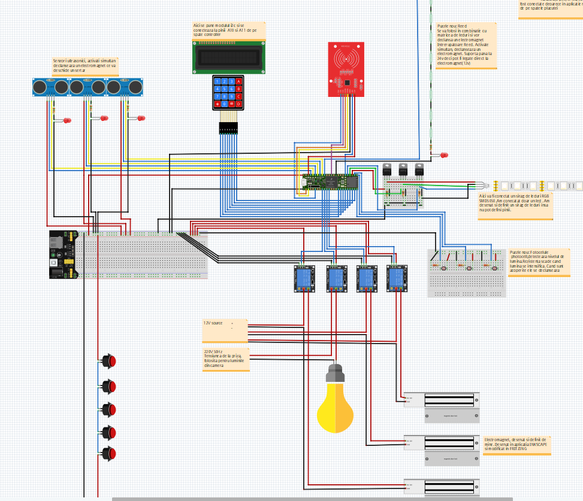
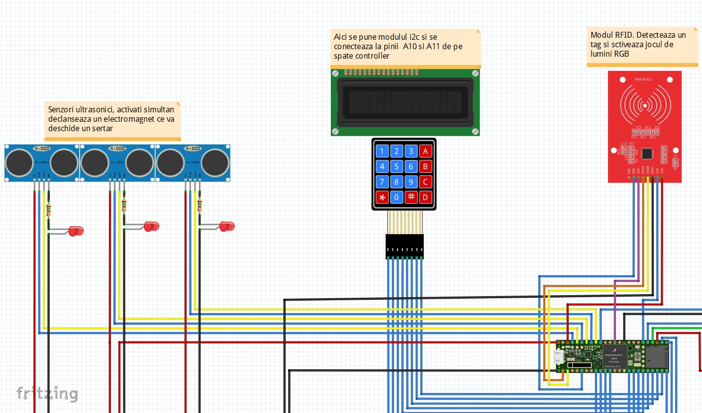
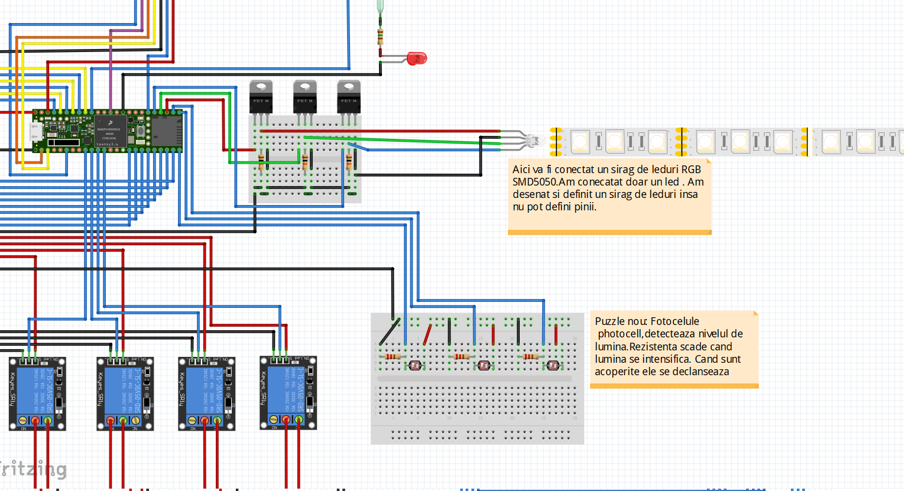
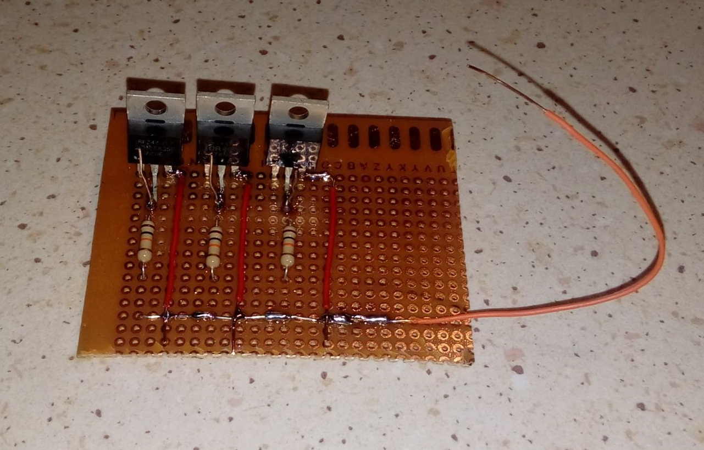
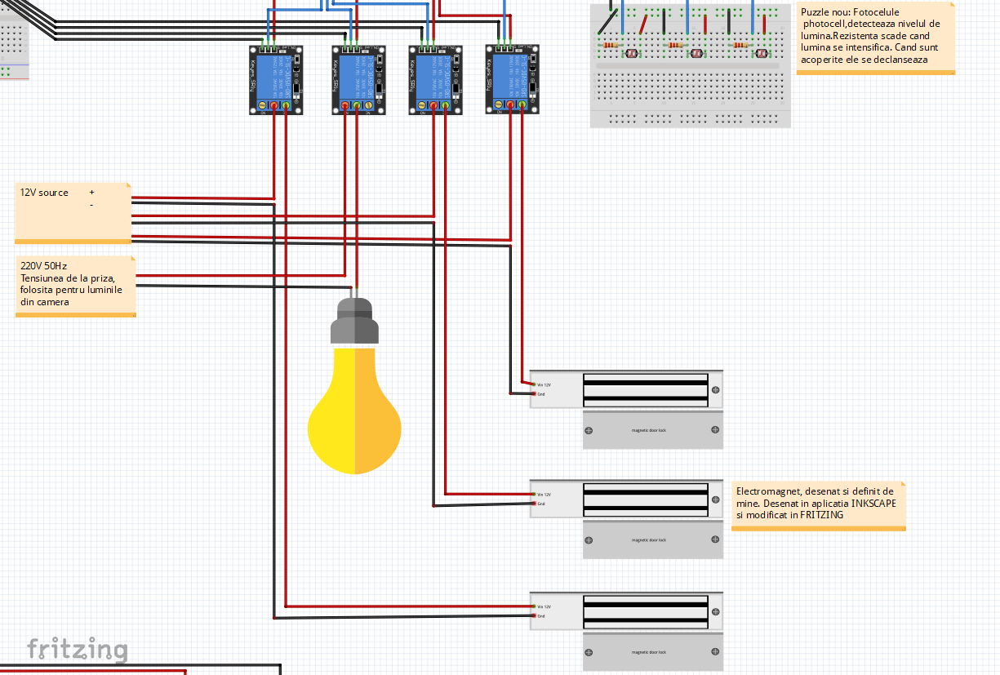
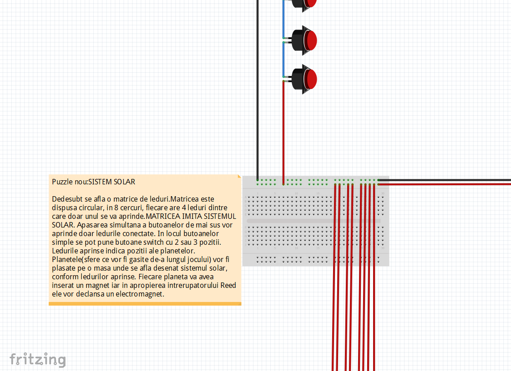
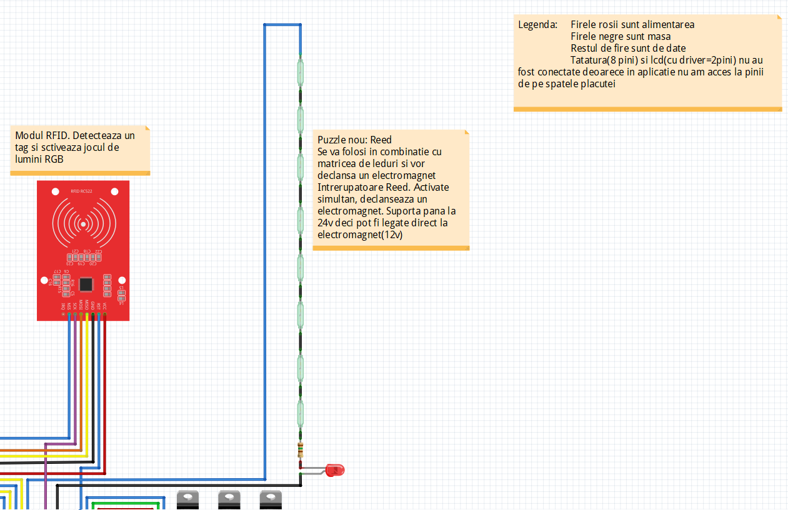
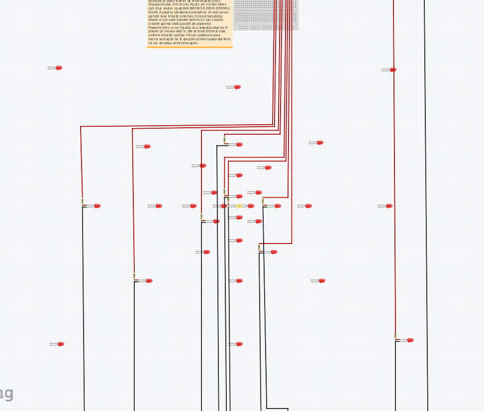
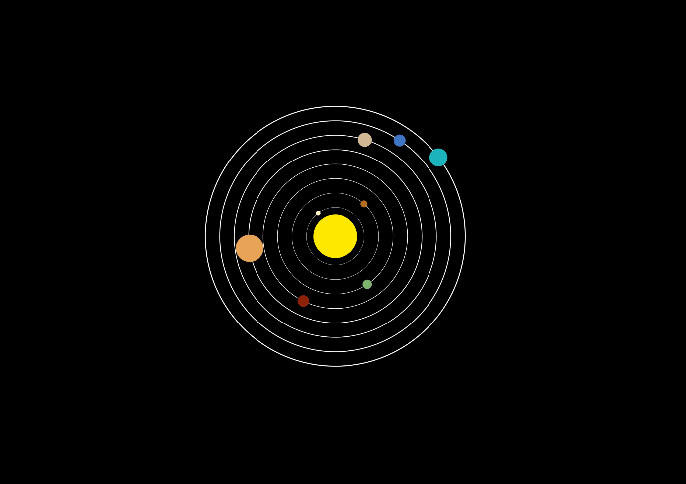

Saptamana7 24nov-02dec

Schema Vizuala
	Am desenat schema electrica cu aplicatia Fritzing
	Biblioteca aplicatiei nu este completa. Am adaugat 2 piese personalizate. Le.am desenat in Inkscape si customizat in editorul Fritzing.
	Piesele adaugate au fost un electromagnet si un sirag de leduri smd5050
	Am utilizat Fritzing deoarece este usor de folosit si are o interfata a componentelor, dispozitivelor si senzorilor foarte realista.
	Am adaugat mai multe poze, una cu intregul desen, dar si pe module(voi numi modul o parte a circuitului care are rolul de a fi folosita ca si puzzle in joc. Fiecare modul este un pas al jocului)

Control sirag rgb
  	Pentru a controla siragul de led smd5050 am lipit un circuit bazat pe mosfet( se vede in poza cu modulul respectiv)

Elemente noi

1.Puzzle Sistemul Solar:
	Dupa cum se vede si in poze, prin apasarea simultana a unor butoane(sau asezarea lor in ordinea corecta pentru butoane switch cu 2 sau 3 pozitii) o serie de leduri vor fi aprinse.
	Ledurile sunt dispuse circular astfel incat sa imite sistemul nostru solar. In centru se afla soarele, un led galben. In jurul soarelui se afla 8 cercuri, fiecare cerc avand 4 leduri din care doar unul se va aprinde.
	Ledurle aprinse indica pozitia in care "planetele" vor fi asezate pe o masa cu un desen asemanator. Planetele sunt de fapt jucarii(bile de plastic sau semisfere) ce au ianuntru un magnet. 
	In interiorul mesei, in pozitiile indicate de leduri se afla intrerupatoare Reed, dispozitive activate de camp magnetic.
	Declansate simultan, intrerupatoarele comanda un releu ce va activa un electromagnet.

2. Photocell
	Dispozitive sensibile la lumina, detecteaza nivelul de lumina cu ajutorul unei rezistente. Se activeaza fie prin luminarea lor fie prin intuneric(acoperirea lor).
	Pot fi comandate de microcontroller sau pot fi folosite fara.	 
	In schema am adaugat 3 astfel de detectori comandati de microcontroller insa trebuie sa ma mai gandesc ce rol vor avea.

Poze:

Circuitul "complet". Inca mai am pini disponibili pe spatele placii deci mai pot fi adaugate module. 

Aici se afla 3 detectoare cu ultrasunete, modulul de detectie RFID si tastatura matriciala cu lcd. in aplicatie nu am gasit modulul driver i2c.

Aici se afla siragul de leduri RGB smd5050 cu tranzistoarele Mosfet de comanda cat si fotocelulele.

Aici e sistemul de relee cu electromagneti

Aici se vad senzorii Reed cat si matricea circulara de leduri. Am pus si o poza cu sistemul solar ca si referinta.

	